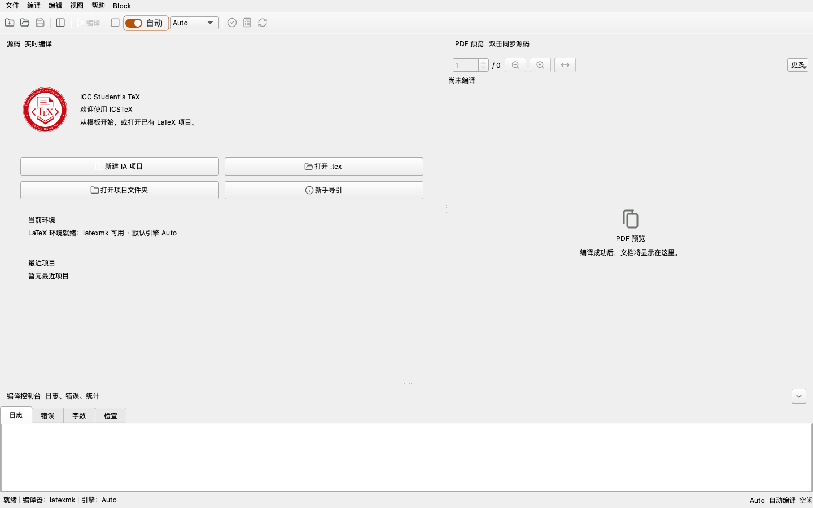
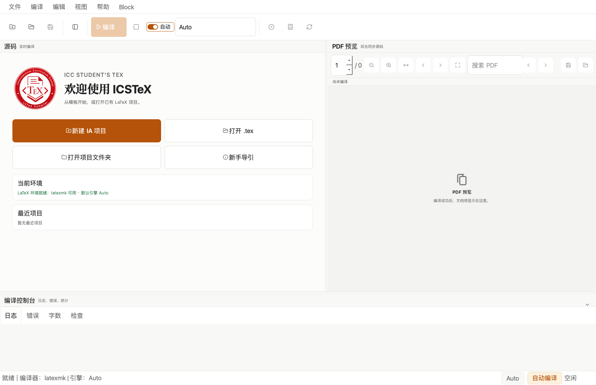
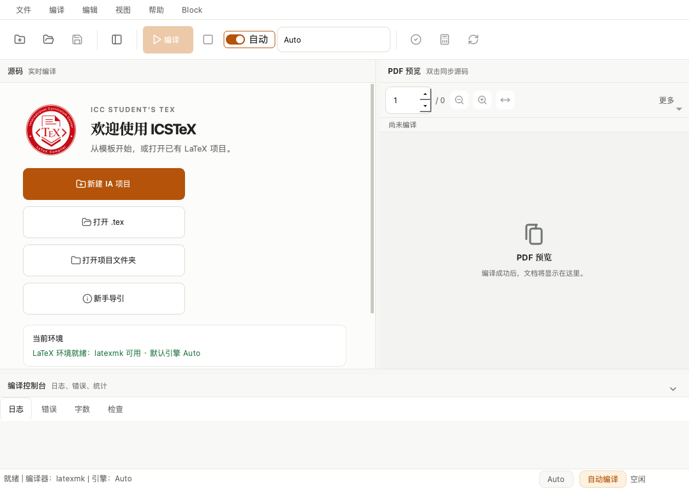
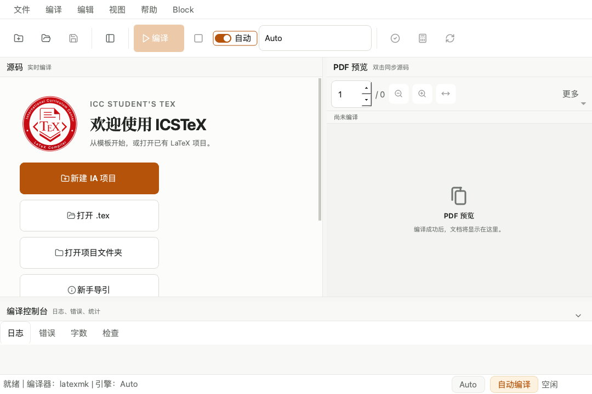
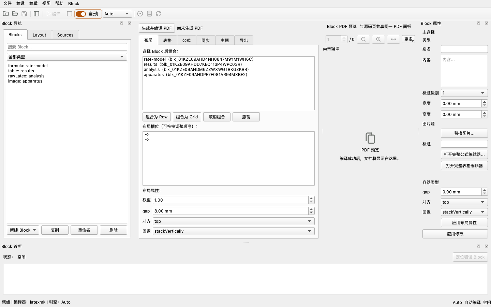

# ICSTeX 使用指引

> 适用版本：未发布开发线（Block 主控制台集成 + UI Scale 与响应式布局收口后）
> 说明：本指引面向 ICC 学生（中文优先），覆盖写作、公式、编译、PDF、Block 工作区与界面缩放。

## 目录

1. [简介](#1-简介)
2. [安装与启动](#2-安装与启动)
3. [界面总览](#3-界面总览)
4. [快速上手：5 分钟写出第一份 PDF](#4-快速上手5-分钟写出第一份-pdf)
5. [源码写作](#5-源码写作)
6. [公式编辑](#6-公式编辑)
7. [编译、预览与 PDF](#7-编译预览与-pdf)
8. [界面缩放与响应式布局](#8-界面缩放与响应式布局)
9. [Block 项目工作区](#9-block-项目工作区)
10. [项目与文件管理](#10-项目与文件管理)
11. [故障排查与诊断](#11-故障排查与诊断)
12. [快捷键速查](#12-快捷键速查)
13. [功能索引](#13-功能索引)
14. [常见问题 FAQ](#14-常见问题-faq)
15. [已知限制与版本说明](#15-已知限制与版本说明)

---

## 1. 简介

ICSTeX 是一款面向 IB/ICC 学生的本地 LaTeX 写作工具：

- **本地优先**：源码、编译、PDF 全部在本机完成，不静默上传任何论文内容；
- **中文优先**：界面与提示以中文为主；
- **两种工作范式并存**：
  - **源码优先**（主编辑器）：直接编辑 `.tex`，LaTeX 是唯一事实源；
  - **模型优先**（Block 工作区）：把内容拆成 Block，可视化排版后自动生成 LaTeX。

## 2. 安装与启动

```bash
cd ICSTeX
python3 -m pip install -r requirements.txt   # 依赖（PySide6 等）
python3 -m app                                # 启动图形界面
```

需要本机已有 LaTeX 工具链（`latexmk`/`xelatex` 等），可在“编译 → 环境医生”中检查。

## 3. 界面总览



| 区域 | 说明 |
| --- | --- |
| 顶部工具栏 | 新建/打开/保存、工具箱、编译/停止、自动编译开关、编译器选择、检查/字数/同步 PDF |
| 左侧工具箱 | 文件、大纲、搜索、图片、历史、插入、模板、引用、标签 |
| 中央 | 源码编辑区（左）与 PDF 预览（右），下方为编译控制台（日志/错误/字数/检查） |
| 顶部菜单 | 文件 / 编译 / 编辑 / 视图（含 UI Scale）/ 帮助 / **Block**（Block 工作区） |

## 4. 快速上手：5 分钟写出第一份 PDF

1. 新建：工具栏“新建文档”，或“文件 → 从模板新建”（EE/IA/实验报告等模板）；
2. 写入内容：源码区输入 LaTeX，或“编辑 → 编辑公式”插入公式；
3. 编译：保持“自动编译”开启，输入暂停后自动保存并编译；或手动点“编译”；
4. 预览：右侧 PDF 面板即时刷新；双击 PDF 可跳回源码（SyncTeX）；
5. 导出：“文件 → 导出 PDF”（正式编译后导出），或在 Finder 中显示。

## 5. 源码写作

- 编辑器支持 LaTeX 语法高亮、自动配对括号、自动 `\item`、代码片段与模板；
- 输入 LaTeX 命令时可用上下方向键选择补全候选，按 Enter 或 Tab 插入当前高亮项。
  补全覆盖常用文本样式、章节、引用、数学、单位、图片和项目拆分命令；例如输入
  `\textc` 可选择 `\textcolor{}{}`，光标会停在颜色参数中。颜色命令需要
  `xcolor`，缺失时“检查项目”会给出加入 package 的修复建议；
- 左侧“插入 → 图片布局”支持左右、上下与 2×2 田字排列。每张图可单独设置
  `\textwidth` 比例；系统只调整宽度并保持原图宽高比，同一行宽度总和不能超过 1.0；
- 编码安全：GB18030/CP1252/Big5 等历史编码可显式指定，不会静默乱码；
- 字数统计：“编译 → 字数统计”，按有效正文、标题、说明/脚注、公式和数字分层预览；
  安装 TeXcount 时使用兼容统计，否则使用本地结构化统计。两种模式都会合并
  `input`/`include`/`subfile`、遵守 `%TC:ignore`，并把中文按汉字而非标点计数；
- 项目检查：“编译 → 检查项目”给出编译健康度与依赖诊断。

### 文本历史恢复（当前开发源码）

在普通源码的历史面板中选择当前文件的登记记录，核对文件名、时间和摘要后确认。
恢复只形成一次可撤销的未保存修改，不保存、不编译；检查内容后再手动保存。
取消、历史损坏或确认期间目标变化会保留当前草稿和磁盘原件。

新历史索引每个文件最多保留 40 项，每项 UTF-8 文本不超过 4 MiB。合法旧历史
仍可读取，但不会自动迁移或清理；清理失败可能留下未索引对象。这不是原始编码/
换行字节的完整项目备份，也不是自动崩溃恢复。这些开发源码更新尚未进入公开安装包。

### 项目检查点与恢复为新目录（当前开发源码）

从“文件 → 创建项目检查点…”或历史面板进入，审阅并勾选文件与独立草稿，再选择
新的检查点文件位置并确认。候选列表不是完整依赖扫描；未选文件不在备份中。
同一项目多个窗口的不同草稿分别保留。相关保存暂时暂停，未变化的既有保存请求
在退出后恢复；采集不会应用草稿、保存源文件或授权编译。

从“文件 → 从检查点恢复为新目录…”选择检查点，核对文件清单、摘要和草稿预览，
然后选择一个不存在的新目录并确认。恢复结果中的 `project/` 是磁盘原始版本，
`drafts/` 是独立 UTF-8 草稿，二者不会自动合并。原项目不会被恢复操作覆盖，也不会
自动切换或编译。可用结果位置按钮查看文件，再自行决定下一步。

恢复成功后可选择“审阅恢复草稿并继续编辑…”，或从文件菜单进入“审阅恢复副本并
继续草稿…”。选择包含 `project/`、`drafts/`、`manifest.json` 的容器目录，核验后
勾选草稿并确认，应用会打开独立编辑窗口，不改变原窗口。草稿默认不勾选；同一目标
有多个版本时只能选择一个，Block 状态与源码草稿不能混选，其余草稿文件仍保留。

源码草稿以一次可撤销编辑载入；未绑定已保存文件的草稿需要另存为。Block 恢复模型
及未应用属性，表格单元格可从待应用列表重开；仍需明确应用、保存。两种模式在首次
显式保存前暂停自动写入和自动编译，保存只更新恢复副本；外部变化或未知格式会拒绝
载入/覆盖并保留草稿。已保存后应正常打开 `project/`，不要再将改变过的副本当作
未修改的恢复清单；如要重新选择旧草稿，先从原检查点恢复另一个新目录。

草稿预览可能截断，但恢复文件保留完整内容。此流程不是自动崩溃恢复，也不会
重建旧会话的完整 Undo 栈；中断 Block 写入日志与旧格式迁移尚未验收。
取消会等待当前读取/清理返回；若输出刚好已生成，界面保留位置提示，不删除结果。
检查点最多 2000 个文件、200 份草稿、合计 256 MiB；单文件 64 MiB、单草稿 16 MiB。
同目录副本不等于独立备份，可列出的云盘目录也不证明文件已经下载。

## 6. 公式编辑

选中完整公式（`$…$`、`\(…\)`、`\[…\]`、equation 环境）后，“编辑 → 编辑公式”
打开可视化公式编辑器：输入结构（分式/根号/上下标/求和/积分等），完成后写回 LaTeX。

当前工作源码的交互更新（尚未进入本机安装版或公开安装包）：

- `/` 生成分式，`^` / `_` 生成上下标；输入 `\alpha` 等命令后按空格或 Enter 转换。
  Tab / Shift+Tab 切换结构槽位，Shift+方向键选择同一槽位内的内容。
- 顶部选择行内、独立或编号形式；源码模式下也可切换外层形式。撤销/重做和底部
  LaTeX 预览同步更新；Enter 不提交，只有“插入/替换公式”或 Cmd+Enter（Windows：
  Ctrl+Enter）确认写入。取消不改正文，文档写入可一次撤销。
- 矩阵、分段和 n 次根式模板进入源码模式填写；不能无损往返的内容保留源码。
  矩阵/分段所需的 amsmath 会列入提交计划，最终正确性仍以完整本地编译为准。

### 内置表格编辑

“插入 → 插入表格”中的第一行为表头，行数只计算数据行。网格从空白开始；双击或
直接键入编辑，Tab 移动，复制/粘贴支持矩形区域。粘贴按钮从当前格填入剪贴板，
不会把第一行数据额外当作表头；若从表头行开始粘贴，第一行自然落在表头。

整块粘贴、清空、导入和尺寸变化可在对话框内撤销。缩小范围会移除已有内容时先确认；
超过 40 个数据行或 12 列的输入被拒绝，不静默截断。明确留空的格子在生成 LaTeX 时
也保持空白；展开“查看将插入的 LaTeX”可检查输出，确认前不修改文档。

Block 表格直接回写其本地模型，支持相同的矩形复制/粘贴、清空和撤销；保留原有行列
标识，正确显示 0 和 False。粘贴上限为 5000 行、200 列、10 万格，超限不修改数据。

## 7. 编译、预览与 PDF

| 功能 | 位置 | 说明 |
| --- | --- | --- |
| 自动编译 | 工具栏开关 | 输入暂停后自动保存并编译（快速预览使用代理图片，正式编译使用原图） |
| 快速预览 | 自动编译开启时 | 与正式编译隔离，保留旧 PDF 直到成功 |
| 正式编译 | 工具栏“编译” | 使用原图完整编译 |
| PDF 面板 | 右侧 | 页码、缩放、适合宽度；窄面板时次要工具收进“更多”菜单 |
| SyncTeX | PDF 双击 / 工具栏“同步 PDF” | 当前正式 PDF 支持双向定位；当前工作源码还支持快速预览 PDF 双击定位原始源码 |
| 导出 | 文件 → 导出 PDF | 先正式编译再导出，保证 PDF 与源码一致 |

快速预览的反向 SyncTeX 已进入本机开发构建，公开安装包尚未更新：双击当前版本的 PDF 正文，可打开对应的
原始 `.tex` 子文件并定位行号；过期、正在重建或无 SyncTeX 数据时不会跳转。
工具栏“同步 PDF”的源码到 PDF 方向仍要求正式编译，导出仍只接受当前正式 PDF。


*PDF 面板变窄（<700 DIP）时，“上一页/下一页/搜索/导出/显示”收进“更多”菜单，
页码、缩放、适合宽度保持可见。*

## 8. 界面缩放与响应式布局

### UI Scale（应用级缩放）

“视图 → UI Scale”提供 90% / 100% / 110% / 125% / 150% 五档：

- 统一调整**字体、按钮、图标、间距、圆角**（从基准字体计算，不会越切越大）；
- 保存到 AppSettings，重启后恢复；
- **不影响** LaTeX 源码、Stable LaTeX 输出与最终 PDF 样式。




### 响应式布局（窗口尺寸变化，不改字号）

欢迎页随可用宽度自动在 4/2/1 列之间切换，内容可滚动：




其他响应式行为：

- 标签栏：空间不足时标题省略并出现滚动按钮，字号与高度不变；
- PDF 工具栏：窄宽度时收进“更多”菜单；
- Dock/Splitter：拖动只重排不改字号，恢复窗口后自动边界校正；
- 编译出错时下方 Block 诊断自动展开。

## 9. Block 项目工作区

“Block → 打开 Block 项目到工作区…”选择项目目录（`demo/` 是现成示例）：



| 面板 | 用途 |
| --- | --- |
| 左：Block 导航（Blocks/Layout/Sources） | 新建/删除/复制/重命名 Block、搜索筛选；布局树；数据源状态 |
| 中央：Block 工作区 | 布局/表格/公式/同步/主题/导出 六个标签 + “生成并编译 PDF” |
| 右：Block 属性 | 按选择显示内容/样式/图片尺寸等，修改进入统一撤销栈 |
| 下：Block 诊断 | 编译日志，出错时“定位错误 Block”跳转到对应块 |

工作流：新建/选择 Block → 布局页拖入槽位（Row/Grid，调权重/gap）→ 表格/公式页编辑 →
点“生成并编译 PDF” → 导出可移植包（含 manifest 与校验和，可空目录编译）。

> 旧入口“帮助 → Block 项目（MVP）”仍可用，且与主工作区共享同一项目状态。

## 10. 项目与文件管理

- 最近项目：欢迎页“最近项目”一键打开；
- 模板：欢迎页“打开 .tex”“打开项目文件夹”；个人模板保存/导入/导出；
- 图片：拖入源码区插入单图，或在普通源码模式使用“插入 → 图片布局”组合多图；
  Block 工作区把图片拖到导航空白处自动建 Image Block，
  拖到已有图片块上替换资源（文件复制进项目，绝不移动原图）；
- 数据源：已有 Block 项目可携带 CSV/XLSX 来源记录；状态入口不执行导入。当前本地开发源码的
  “来源”页通过“刷新状态”后台比较磁盘与记录摘要；选择来源可看详情和定位关联 Block。
  刷新不导入、不保存、不推进基线；同内容候选只表示可能移动，超限/不可读/多个候选为未知。
  状态是有时间标记的检查记录，外部文件变化后请重新刷新。此流程尚未进入公开安装包；
  [验收边界](v1-m3-source-status-verification-2026-09-11.md) 包含查找范围及待完成的原生验证。
  本地源码另有“比较并合并来源…”：选择项目内、摘要匹配的原始版本，为每个关联表格
  声明 CSV 编码或 XLSX 工作表/范围，核对全部列映射与唯一行键，再预览候选。
  只有最后确认全部表格，才统一应用表格及来源摘要；一次全局 Undo 可撤销，并找回
  被纳入的未应用表格草稿。独立候选确认本身仍不修改项目。原始数据不改写，项目沿用
  现有保存冲突保护；原始和当前数据版本需另行保留，本操作不是备份。缺少基线、重复键、
  来源/对象变化或取消均不应用。XLSX 只读缓存、不执行公式；没有缓存的公式拒绝导入。
  [修复流程与大小/原生限制](v1-m3-source-repair-verification-2026-09-11.md)。

当前本地开发源码中，普通 LaTeX 项目可打开工具箱的“引用”页，点击
“检查项目引用（只读）”。“引用检查”列出重复 key、未找到的引用、解析未知及未使用
建议；选择结果和位置，再点“定位所选位置”查看定义或使用处。打开但未保存的
BibTeX 内容按缓冲区检查，不会顺手保存。编辑、切换或外部变化后需要主动重新检查。
检查不编译、不联网、不改文献；未使用仅为建议。手写/动态/分区文献等未支持语法
保持未知，不表示编译失败。旧“快捷库”仍只显示约定位置，不代表整个项目文献库。
此功能尚未进入公开安装包，范围及限制见
[引用健康验证记录](v1-m3-citation-health-verification-2026-09-11.md)。

普通源码的“图片”页还提供“检查素材使用（只读）”。“使用检查”显示受支持的
静态引用位置、缺失、内容变化、同内容候选和未使用建议；选择结果及位置后可定位。
未保存子文件替代磁盘引用，位置数不等于 TeX 执行次数。动态路径、歧义或超限为
未知；同内容候选不证明已移动，未使用不应直接删除。检查不会保存、编译、移动
素材或重写引用，编辑和外部变化后需要重新检查。“快捷浏览”只在内存缓存缩略信息，
使用状态显示“使用待检查”；变化对比来自本窗口上次可读记录，重开不保留，也不是备份。
此功能仅在本地开发源码中，限制和待完成的原生验收见
[素材使用验证记录](v1-m3-material-usage-verification-2026-09-11.md)。

## 11. 故障排查与诊断

- 编译失败：底部“错误”标签查看定位；旧 PDF 保留直到编译成功；
- 环境问题：“帮助 → 环境医生”检查 TeX/Python/依赖；
- 反馈包：“帮助 → 复制反馈包”收集环境与编译诊断摘要（不含论文正文）；
- 导入性能：“帮助 → 导入性能诊断”查看拖拽导入各阶段耗时；
- Block 编译错误：Block 诊断 → “定位错误 Block”；
- 公式无法解析：进入公式编辑器源码模式手改，不删除原始内容。

## 12. 快捷键速查

| 快捷键 | 功能 |
| --- | --- |
| `Ctrl+N` / `Ctrl+O` / `Ctrl+S` | 新建 / 打开 / 保存 |
| `Ctrl+F` / `Ctrl+H` | 查找 / 查找替换 |
| `Ctrl+,` | 设置 |
| `Ctrl+Shift+Z` / `Ctrl+Shift+Y` | Block 全局撤销 / 重做 |
| PDF 面板双击 | SyncTeX 源码跳转 |
| 编辑器内 | 自动补全环境、自动配对括号（可在“编辑”菜单开关） |

## 13. 功能索引

| 想做的事 | 去这里 |
| --- | --- |
| 写正文 / 手写 LaTeX | [源码写作](#5-源码写作) |
| 插入公式 | [公式编辑](#6-公式编辑)、编辑 → 编辑公式 |
| 自动编译 / 快速预览 | [编译、预览与 PDF](#7-编译预览与-pdf) |
| 放大界面 | 视图 → UI Scale（[§8](#8-界面缩放与响应式布局)） |
| 可视化排版（Block） | Block → 打开 Block 项目到工作区…（[§9](#9-block-项目工作区)） |
| 统计字数 / 检查项目 | 编译 → 字数统计 / 检查项目 |
| 找编译错误 | 底部“错误”标签 / Block 诊断（[§11](#11-故障排查与诊断)） |
| 导出 PDF / 可移植包 | 文件 → 导出 PDF；Block 工作区 → 导出 |
| 环境问题 | 帮助 → 环境医生 |
| 模板 | 欢迎页 / 插入 → 模板 |
| 中文乱码 | 文件打开时选择编码（[§10](#10-项目与文件管理)） |

## 14. 常见问题 FAQ

**Q：自动编译为什么用“快速预览”？** 快速预览使用代理图片加速，正式输出以手动“编译”为准。

**Q：改 UI Scale 会不会改坏我的文档？** 不会，UI Scale 只影响界面，不写项目、不改变
Stable LaTeX 与 PDF 样式。

**Q：Block 工作区和源码编辑是什么关系？** 两种范式并存：Block 生成的 `main.tex` 是合法
LaTeX，可在主编辑器打开继续编辑；主编辑器手改的 `.tex` 不会自动回写 Block 模型。

**Q：编译失败会丢旧 PDF 吗？** 不会，旧 PDF 保留直到下一次成功编译。

**Q：为什么没有“另存为”的位置提示？** “文件 → 另存为”会按当前文档选择保存位置。

## 15. 已知限制与版本说明

- 当前开发线为“Block 主控制台集成 + UI Scale 响应式布局”收口后状态，本地 659 项测试通过，
  尚未发布版本标签（版本线由维护者决定）；
- Block 布局容器间嵌套拖拽与像素级画布未实现（见集成报告）；
- 多显示器切换未经真实外接屏手测（仅内置 Retina + Qt6 High DPI 静态审计）；
- 完整测试套件耗时约 2 分钟（见性能报告，属测试隔离技术债，不影响使用）。

相关文档：[固定尺寸审计](ui-scale-fixed-size-audit.md)、
[UI Scale 报告](ui-scale-responsive-layout-report.md)、
[视觉验收](ui-scale-visual-acceptance.md)、
[性能报告](ui-scale-performance-report.md)、
[Block 集成报告](block-console-integration-report.md)。
