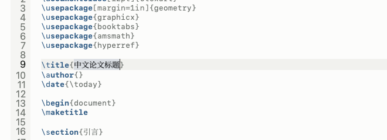
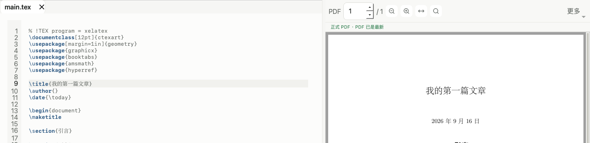
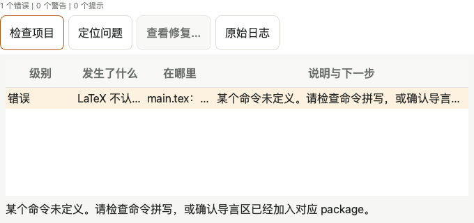
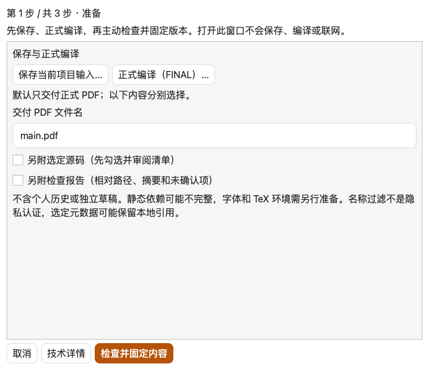

# ICSTeX 使用指引

> 适用版本：当前开发源码。下文的交互式练习和新配图尚未发布到旧安装包。
> 说明：本指引面向 ICC 学生（中文优先），覆盖写作、公式、编译、PDF、Block 工作区与界面缩放。

## 目录

1. [简介](#1-简介)
2. [安装与启动](#2-安装与启动)
3. [界面总览](#3-界面总览)
4. [先写出第一页 PDF](#4-先写出第一页-pdf)
5. [源码写作](#5-源码写作)
6. [公式编辑](#6-公式编辑)
7. [编译、预览与 PDF](#7-编译预览与-pdf)
8. [界面缩放与响应式布局](#8-界面缩放与响应式布局)
9. [Block 项目工作区](#9-block-项目工作区)
10. [项目与文件管理](#10-项目与文件管理)
11. [故障排查与诊断](#11-故障排查与诊断)
12. [快捷键速查](#12-快捷键速查)
13. [功能索引](#13-功能索引)
14. [常见问题 FAQ](#14-常见问题-faq)
15. [已知限制与版本说明](#15-已知限制与版本说明)

---

## 1. 简介

ICSTeX 是一款面向 IB/ICC 学生的本地 LaTeX 写作工具：

- **本地优先**：源码、编译、PDF 全部在本机完成，不静默上传任何论文内容；
- **中文优先**：界面与提示以中文为主；
- **两种工作范式并存**：
  - **源码优先**（主编辑器）：直接编辑 `.tex`，LaTeX 是唯一事实源；
  - **模型优先**（Block 工作区）：把内容拆成 Block，可视化排版后自动生成 LaTeX。

## 2. 安装与启动

```bash
cd ICSTeX
python3 -m pip install -r requirements.txt   # 依赖（PySide6 等）
python3 -m app                                # 启动图形界面
```

需要本机已有 LaTeX 工具链（`latexmk`/`xelatex` 等），可在“编译 → 环境医生”中检查。

## 3. 界面总览


上图为历史布局；当前工作台改动与验收边界见[性能/UI进度](PERFORMANCE_UI_PROGRESS.md)。

| 区域 | 说明 |
| --- | --- |
| 顶部工具栏 | 新建/打开/保存、正式编译/停止、自动编译开关、工具箱/控制台/定位 PDF；编译器在“编译 → 编译器”菜单 |
| 左侧工具箱 | 文件、大纲、搜索、图片、历史、插入、模板、引用、标签 |
| 中央 | 宽窗源码/PDF并排，未编译时预览区缩窄，窄窗切换；下方控制台默认收起，可从顶部或底栏“控制台”展开 |
| 顶部菜单 | 文件 / 编译 / 编辑 / 视图（含 UI Scale）/ 帮助 / **Block**（Block 工作区） |

当前开发源码可用 Tab / Shift+Tab 进出工具导航，方向键切换工具。大纲、搜索、
诊断和错误列表用方向键移动，空格明确选中当前行，再按 Return / Enter 定位。
只有焦点框、尚未选中时不会定位；单条搜索结果也可用“空格 → Return”。
这些键只定位，不执行保存、编译或修复。公开安装版不因此视为已包含此增量。
当前开发源码的诊断控制台会为内容调整高度；小窗口或较大 UI Scale 下，Tab 与
方向键会把当前按钮或诊断行滚动到可见区域。“控制台”按钮展开/收起整个面板，保留
上次选中的日志、错误、字数或检查页，不会强制切换到字数页或立即重算。
“编译 → 字数统计”仍可直接进入字数页并刷新统计。插入面板不再提供旧“分段函数”
按钮；公式编辑器内的分段结构模板保留。
窄窗中工具箱与控制台按当前任务切换，放宽窗口后恢复此前宽窗布局。自动错误提示
不会隐藏正在输入的工具箱字段；可按提示手动展开控制台查看。项目导航中的
“展开项目状态”提供完整、可选择复制的只读状态，长内容在该区域内滚动。

大纲优先显示章节标题，类型与行号放在旁边；悬停可查看完整标题和原命令。
引用“快捷库”上方显示实际读取路径，可选择复制。它仍按当前文件目录读取
`bib/references.bib`或`references.bib`；空列表不代表项目没有引用。使用其他名字
（例如`refs.bib`）时，点“检查引用”查看项目实际声明的库，不会自动合并或改写文件。

## 4. 先写出第一页 PDF

### 先用练习副本试一遍

从欢迎页或“帮助”菜单打开“新手导引”，点“开始练习（独立副本）”。
练习在单独窗口打开，不会改你的原稿或原来的编辑设置。

1. 点“选中标题”，换成你自己的标题。只改大括号里的文字。
2. 点“正式编译”。这一步会把 .tex 中的内容排成 PDF。
3. 在 PDF 中找到新标题，再点“我看到了新标题”。窄窗口先点“显示 PDF”。



可以随时“收起导引”，从“帮助 → 新手导引”继续。内容会保留；如果关闭过练习窗口，
回来后需要再编译一次，确认 PDF 对应当前内容。“另建一个练习副本”会创建新目录，不覆盖旧练习。

如果还没有 LaTeX 工具，先保留写下的内容，回到欢迎页查看安装指引或打开环境医生。
ICSTeX 不会自动安装 MacTeX、TeX Live 或 MiKTeX。

### 开始自己的文稿

点“新建项目”，选择写作语言、模板和保存位置。中文文稿可选“中文 XeLaTeX 文章”，
高级设置中的编译器保留“自动选择（推荐）”。已有文件夹不会被覆盖。

左边写内容，右边看排版。第一次主动点“正式编译”。开启“自动快速预览”后，
后续改动会在你停笔并自动保存后更新。正式编译使用原图，适合检查质量和导出前核对。



“文档已保存”只说明文字写进了文件，不代表 PDF 已更新。看到“当前显示旧版本”时，
右边仍是上次成功的结果。等到最新状态出现，再检查排版。

### 报错时先处理第一条

打开控制台的“检查”或“错误”页，选一条提示，点“定位问题”回到相关位置。
需要更多细节时展开“原始日志”。“查看修复…”会先展示修改，点“应用修改”才会写入文稿，可以撤销。



找不到图片时核对文件名和相对路径；命令不认识时先检查拼写。修正后重新编译。
旧 PDF 还在，不代表这次已经成功。

### 导出一份可以发给别人的 PDF

点“导出 PDF”或“文件 → 准备提交”。按窗口提示保存和正式编译，点“检查并固定内容”，
阅读检查结果，再选择原项目之外的新目录并确认生成。



“未确认”不等于通过。默认只交付正式 PDF；要附上源码，需要主动勾选并检查文件清单。
生成的文件留在本机，不会自动上传。

### 把整个工程带到另一台电脑（当前开发源码）

先保存文稿，再点“文件 → 导出为工程文件…”。窗口会列出项目内的源码、图片、
表格数据、引用库和本地样式；取消不想分享的文件，点“导出 ZIP…”并选择新文件名。
不需要先编译成功，也不会修改原工程或自动发送给别人。

在另一台电脑解压 ZIP，用 ICSTeX 打开其中的 `project` 文件夹，再打开包内说明标出的
主文件。子文件夹、相对路径、编码和原文不变。接收方仍需安装 LaTeX 环境和所需字体。

未保存内容和外部冲突需要先处理。缺失文件、动态路径、项目外引用或被取消勾选的
依赖会提示；确认后可以只导出现有文件，但不能当成材料已齐全。软件不会擅自读取
项目外目录，也不会改写绝对路径。建议先把外部素材放进项目内，并改成相对路径。
历史、草稿、编译缓存、脚本和不支持的文件类型不在默认清单内；一次最多 2000 个文件、
单文件 64 MiB、原始文件合计 256 MiB，沿用既有安全限制。已有 ZIP 不会被覆盖。

## 5. 源码写作

- 编辑器支持 LaTeX 语法高亮、自动配对括号、自动 `\item`、代码片段与模板；
- 输入 LaTeX 命令时可用上下方向键选择补全候选，按 Enter 或 Tab 插入当前高亮项。
  补全覆盖常用文本样式、章节、引用、数学、单位、图片和项目拆分命令；例如输入
  `\textc` 可选择 `\textcolor{}{}`，光标会停在颜色参数中。颜色命令需要
  `xcolor`，缺失时“检查项目”会给出加入 package 的修复建议；
- 左侧“插入 → 图片布局”支持左右、上下与 2×2 田字排列。每张图可单独设置
  `\textwidth` 比例；系统只调整宽度并保持原图宽高比，同一行宽度总和不能超过 1.0；
- 编码安全：GB18030/CP1252/Big5 等历史编码可显式指定，不会静默乱码；
- 字数统计：“编译 → 字数统计”，按有效正文、标题、说明/脚注、公式和数字分层预览；
  安装 TeXcount 时使用兼容统计，否则使用本地结构化统计。两种模式都会合并
  `input`/`include`/`subfile`、遵守 `%TC:ignore`，并把中文按汉字而非标点计数；
- 项目检查：“编译 → 检查项目”给出编译健康度与依赖诊断。

当前开发源码的字数/提交检查面板支持 Tab、Shift+Tab 在刷新、结果和详情间移动；
方向键选择检查项，Home/End 阅读只读预览或详情首尾。小控制台会自动滚动到当前
目标。刷新不会保存、编译或联网；“下一步”仍需单独明确执行。
提交检查先显示未通过、未知、通过数量，优先列出需处理的项目。选择一项即可阅读
原因与下一步；“技术详情”保留完整输入身份、规则和位置，可选择复制。“展开阅读”
临时收起列表和摘要，“返回列表”恢复原选中项与宽度。刷新、取消和下一步固定在
底部，未知项不会算作通过。这些新布局的原生/完整验收仍在进行。

### 文本历史恢复（当前开发源码）

在普通源码的历史面板中选择当前文件的登记记录，核对文件名、时间和摘要后确认。
恢复只形成一次可撤销的未保存修改，不保存、不编译；检查内容后再手动保存。
取消、历史损坏或确认期间目标变化会保留当前草稿和磁盘原件。

新历史索引每个文件最多保留 40 项，每项 UTF-8 文本不超过 4 MiB。合法旧历史
仍可读取，但不会自动迁移或清理；清理失败可能留下未索引对象。这不是原始编码/
换行字节的完整项目备份，也不是自动崩溃恢复。这些开发源码更新尚未进入公开安装包。

### 项目检查点与恢复为新目录（当前开发源码）

检查点、恢复和迁移窗口的主要确认/取消按钮固定在底部。长路径、文件清单、预览
与范围说明在正文内滚动；Tab切到输入框时会将它带入可见区域。迁移生成副本后，
才显示选择入口和“核验并打开副本…”；打开仍需单独确认，不会自动替换当前项目。

从“文件 → 创建项目检查点…”或历史面板进入，审阅并勾选文件与独立草稿，再选择
新的检查点文件位置并确认。候选列表不是完整依赖扫描；未选文件不在备份中。
同一项目多个窗口的不同草稿分别保留。相关保存暂时暂停，未变化的既有保存请求
在退出后恢复；采集不会应用草稿、保存源文件或授权编译。

从“文件 → 从检查点恢复为新目录…”选择检查点，核对文件清单、摘要和草稿预览，
然后选择一个不存在的新目录并确认。恢复结果中的 `project/` 是磁盘原始版本，
`drafts/` 是独立 UTF-8 草稿，二者不会自动合并。原项目不会被恢复操作覆盖，也不会
自动切换或编译。可用结果位置按钮查看文件，再自行决定下一步。

恢复成功后可选择“审阅恢复草稿并继续编辑…”，或从文件菜单进入“审阅恢复副本并
继续草稿…”。选择包含 `project/`、`drafts/`、`manifest.json` 的容器目录，核验后
勾选草稿并确认，应用会打开独立编辑窗口，不改变原窗口。草稿默认不勾选；同一目标
有多个版本时只能选择一个，Block 状态与源码草稿不能混选，其余草稿文件仍保留。

源码草稿以一次可撤销编辑载入；未绑定已保存文件的草稿需要另存为。Block 恢复模型
及未应用属性，表格单元格可从待应用列表重开；仍需明确应用、保存。两种模式在首次
显式保存前暂停自动写入和自动编译，保存只更新恢复副本；外部变化或未知格式会拒绝
载入/覆盖并保留草稿。已保存后应正常打开 `project/`，不要再将改变过的副本当作
未修改的恢复清单；如要重新选择旧草稿，先从原检查点恢复另一个新目录。

草稿预览可能截断，但恢复文件保留完整内容。此流程不是自动崩溃恢复，也不会
重建旧会话的完整 Undo 栈；已知旧格式迁移采用下述独立流程。
取消会等待当前读取/清理返回；若输出刚好已生成，界面保留位置提示，不删除结果。
检查点最多 2000 个文件、200 份草稿、合计 256 MiB；单文件 64 MiB、单草稿 16 MiB。
同目录副本不等于独立备份，可列出的云盘目录也不证明文件已经下载。

### 中断 Block 写入的比较与恢复（当前开发源码）

遇到未解决的写入日志时，不要删除 `.icstex/block-write.pending` 来强行保存。
从“文件 → 审阅中断 Block 写入并恢复…”选择原项目，审阅文件清单。每个写入目标
须显式选择“写入前”“计划写入后”或“当前磁盘”；没有默认胜出方。预览列出原始
字节大小、摘要和可读文本；文本显示可截断，复制的内容不截断或统一编码。

选择原项目之外、尚不存在的新目录，确认后才生成恢复容器。已知 Block 元数据与
受管生成源码必须一致，混选不一致版本会拒绝恢复；未知格式、损坏或审阅后变化
也会拒绝。日志只覆盖本次变更文件，其余选定文件取自当前磁盘，并非完整历史快照。
选定文件与所有写入目标合计最多 2000 项；单个日志证据最多 4 MiB，前后证据合计
64 MiB，整个恢复输出连同独立草稿及证据最多 256 MiB。

恢复结果的 `project/` 可以正常打开并由你显式正式编译；`drafts/` 保留窗口草稿，
`recovery-evidence/` 保留日志、当前冲突版本和选择报告。原项目与原 pending 日志
不修改、不删除，也不会自动切换项目或编译。若要继续独立草稿，使用结果中的审阅
入口；后续修改过的恢复项目应正常打开，不再当作未修改的恢复清单。

本地 macOS 合成恢复流程已验证；限定 Qt/macOS 版本的辅助功能崩溃临时保护会让
“选中子项枚举”不可用，不等于完整辅助功能验收。断电、Windows、云端文件可用性、
输入法和真人验收仍分别待做，见
[验证记录与限制](v1-m4-write-recovery-verification-2026-09-11.md)。

### 审阅并迁移到新副本（当前开发源码）

从“文件 → 审阅并迁移到新副本…”选择原项目，勾选实际要保留的文件，再生成预览。
选择副本清单中的文件，可比较原件和候选的大小、摘要及内容；非 UTF-8 仅显示
十六进制开头，不转换原始编码。列表与长内容可滚动，预览截断不代表文件截断。

普通 LaTeX 和当前 Block 项目按原字节复制。只有已知旧格式进行转换：副本中生成
当前 Block 元数据和受管源码，全部选定原件另存于 `recovery-evidence/original/`。
未映射字段仍保留在原 JSON 中，并在报告列出。旧 LaTeX 片段保留原文但默认不受信任，
不会出现在正式 PDF 中；此流程不保证旧文档排版完全一致。未知格式、缺少选定图片、
元数据/生成源码冲突或中断写入日志会拒绝迁移，不自动修复原件。

审阅后指定原项目之外、尚不存在的新目录并确认，才生成 `project/`、`drafts/` 和
证据报告。随后可单独选择“核验并单独确认打开副本…”，确认后在独立窗口打开，
不关闭原窗口、不套用草稿、不授权编译。普通项目可选择副本内的 LaTeX 入口。
对话框关闭后，原窗口未变化的既有自动保存请求会恢复；并非永久关闭自动保存。

如需继续独立草稿，使用“文件 → 审阅恢复副本并继续草稿…”。旧草稿若原本对应
转换后重新生成的路径，会作为未绑定文件的独立草稿打开，需要明确另存为，不能
自动覆盖新生成的源码。原目标仍在决定报告中保留。修改过的副本应正常打开
`project/`；不要将它冒充为仍与原清单一致的副本。

这里只覆盖选定且实际读到的本地字节，不证明依赖完整或云文件已下载。原生界面、
Windows、输入法、辅助功能与真人验收未由离屏测试代替；验证状态见
[迁移界面证据](v1-m4-migration-gui-verification-2026-09-11.md)。

## 6. 公式编辑

选中完整公式（`$…$`、`\(…\)`、`\[…\]`、equation 环境）后，“编辑 → 编辑公式”
打开可视化公式编辑器：输入结构（分式/根号/上下标/求和/积分等），完成后写回 LaTeX。

2026-09-20 开发源码中，↑/↓ 按上标、底数、下标或分子、分母的位置切换；邻接结构也可
直接进入。导航不创建新的上下标、不改公式；`^`/`_` 用于创建上标/下标，Tab 切换输入框。
编辑区下方会提示当前光标位置。
可视编辑区的字符、上下标、分式和上下限留有额外间距，便于点选；这只影响编辑显示，
不在 LaTeX 中插入空格，也不改变编译后的 PDF 排版。

当前不提供手写识别；试验未达到质量要求，入口已撤回。原有“图片识别…”仍为可选功能，
见[本地公式识别说明](local-formula-ocr-user-guide.md)。当前安装版未随本轮源码自动更新。

既有公式编辑功能（安装包的实际范围以 `PROJECT_STATE.md` 为准）：

- `/` 生成分式，`^` / `_` 生成上下标；输入 `\alpha` 等命令后按空格或 Enter 转换。
  Tab / Shift+Tab 切换结构槽位，Shift+方向键选择同一槽位内的内容。
- 顶部选择行内、独立或编号形式；源码模式下也可切换外层形式。撤销/重做和底部
  LaTeX 预览同步更新；Enter 不提交，只有“插入/替换公式”或 Cmd+Enter（Windows：
  Ctrl+Enter）确认写入。取消不改正文，文档写入可一次撤销。
- 可视区与源码模式支持组合输入；输入法候选确认前，预编辑文字不进入 LaTeX。
  先确认或取消候选，再应用公式或切换编辑模式；已提交文字可撤销/重做。
- “收起数字区 / 显示数字区”只调整键盘布局，保留公式、选区与撤销历史。
  分类、结构按键与光标选区使用统一主题；最终仍须显式插入或替换。
- 小窗口/大字号时，公式正文可滚动，底部插入/替换与取消固定可见。物理Control+Tab
  从可视编辑区前往分类按钮，从源码编辑区前往LaTeX预览；Control+Shift+Tab返回
  源码模式开关。此快捷键只在两个编辑区生效，不应用公式；未结束的组合输入需先处理。
- 矩阵、分段和 n 次根式模板进入源码模式填写；不能无损往返的内容保留源码。
  矩阵/分段所需的 amsmath 会列入提交计划，最终正确性仍以完整本地编译为准。
- 当前开发源码保留 emoji 等字符前后的公式选区与插入位置。编辑期间源码或目标
  改变时拒绝应用，保留草稿及可复制预览；重新确认目标后再打开，不覆盖新内容。

### 内置表格编辑

“插入 → 插入表格”中的第一行为表头，行数只计算数据行。网格从空白开始；双击或
直接键入编辑，Tab 移动，复制/粘贴支持矩形区域。粘贴按钮从当前格填入剪贴板，
不会把第一行数据额外当作表头；若从表头行开始粘贴，第一行自然落在表头。

整块粘贴、清空、导入和尺寸变化可在对话框内撤销。缩小范围会移除已有内容时先确认；
超过 40 个数据行或 12 列的输入被拒绝，不静默截断。明确留空的格子在生成 LaTeX 时
也保持空白；展开“查看将插入的 LaTeX”可检查输出，确认前不修改文档。

当前开发源码中，插入表格与补齐宏包可在正文中一次撤销，保留此前编辑的撤销历史。
如果编辑期间源码、选区或目标项目改变，确认会被拒绝，表格草稿和 LaTeX 预览仍保留；
可先复制预览内容，再取消并在正确位置重新打开。这不代表公开安装版已包含该修复。

Block 表格直接回写其本地模型，支持相同的矩形复制/粘贴、清空和撤销；保留原有行列
标识，正确显示 0 和 False。粘贴上限为 5000 行、200 列、10 万格，超限不修改数据。

## 7. 编译、预览与 PDF

| 功能 | 位置 | 说明 |
| --- | --- | --- |
| 自动编译 | 工具栏开关 | 输入暂停后自动保存并编译（快速预览使用代理图片，正式编译使用原图） |
| 快速预览 | 自动编译开启时 | 与正式编译隔离，保留旧 PDF 直到成功 |
| 正式编译 | 工具栏“正式编译” | 使用原图完整编译 |
| PDF 面板 | 右侧 | 页码、缩放、适合宽度；窄面板时次要工具收进“更多”菜单 |
| 搜索 PDF（开发源码） | 放大镜按钮 / 更多 / 视图菜单 | 展开独立搜索行；窄面板也保留入口 |
| SyncTeX | PDF 双击 / 工具栏“定位 PDF” | 当前开发源码中，最新快速预览和正式 PDF 都支持双向定位；不额外保存或编译 |
| 导出 | 文件 → 准备提交 / 导出 PDF | 开发源码核对固定输入与实际 FINAL，确认后写入新目录；不接受预览 PDF |

当前开发源码中，把光标放到原始 `.tex` 主文件或子文件，点击“定位 PDF”，即可使用
最新快速预览定位；窄窗口会切到 PDF。双击 PDF 正文则回到源码，目标行淡黄色高亮约
2 秒；移动光标、编辑或隐藏源码时消失，不选中文字。按 SyncTeX 的行级映射定位，
不保证逐字对应。过期、正在重建、
查询期间内容变化或无 SyncTeX 数据时不跳转，也不会为了定位自动生成正式 PDF。
正向预览定位与目标行高亮已进入 2026-09-19 本地安装包；公开版本能力以对应制品记录为准。
导航可用不等于可以交付，正式导出仍走既有保存、FINAL 编译和准备提交检查。

当前开发源码可用 macOS `Command+Option+F`（其他平台 `Ctrl+Alt+F`）进入PDF搜索。
输入关键词后，Enter切换匹配，Esc收起搜索并返回之前的焦点；组合输入尚未结束时
不会用Enter跳转或用Esc关闭搜索行。相同内容的新构建可以保留页面/缩放/搜索，
但构建身份仍更新；“PDF文件已载入”与编译、页面实际绘制是不同状态。

当前开发源码的“准备提交”分为三步：准备、审阅固定内容、选择目标并确认。先单独
保存、正式编译，选择PDF文件名与可选源码/报告，再点“检查并固定内容”。默认只输出
PDF；源码仅在准备页勾选，可全选或清空。审阅检查项及实际输出清单，明确知悉未确认项
后进入目标页，确认原项目之外的新目录。完整路径和摘要可在“技术详情”选择复制；此处
不预览PDF版面，交付使用本次固定原始字节。成功后可复制结果路径或点击“打开交付目录”。
返回上一步保留固定版本，实际选项、输入或构建变化则须重新检查；
失败不覆盖已有交付。源码在 source/，原 README/manifest 保留，生成的说明和报告分开。
静态未知项不是通过，文件名过滤不是隐私认证，字体/TeX 环境仍需另行准备。
此前交付GUI的专项、合成原生流程与全套已通过；本次三阶段改版有离屏交付和专项证据，
原生与整体验收尚未完成，见[性能/UI进度](PERFORMANCE_UI_PROGRESS.md)。后续 MCP 另补实际 FINAL/内容复核与
独占发布，便携包保留原 README/manifest，生成元数据放在 `.icstex-package/`；但旧 API
没有逐文件审阅，不能当作隐私认证。共享 FINAL 暖缓存修复已通过专项与原生流程，
新全套首次发生 Qt 样式表崩溃，同源码复跑通过，但原因仍未查明。后续 FINAL 会保留
实际进程输出的初始构建工具/引擎版本，并随审阅报告固定；导出时不额外查询环境。
这是工具自报标签，不是二进制认证；旧记录、未知格式和辅助工具版本仍显示未知。
见[构建版本标签验证](v1-m5-tool-versions-verification-2026-09-11.md)。
见[交付接入证据](v1-m5-delivery-gui-verification-2026-09-11.md)及
[Agent/MCP 当前验证](v1-m5-agent-export-verification-2026-09-11.md)。
后续另修复了确认关窗后的控件残留，取消关闭仍保留草稿；原生及完整回归通过，
但不视为原 SIGSEGV 同因证明，见[窗口生命周期验证](v1-m6-window-lifetime-verification-2026-09-11.md)。


*上图为旧版工具栏示意。当前开发源码在窄面板保留独立搜索按钮与展开行；
上一页/下一页、适合页面、导出/显示仍可从“更多”菜单进入。*

## 8. 界面缩放与响应式布局

### UI Scale（应用级缩放）

“视图 → UI Scale”提供 90% / 100% / 110% / 125% / 150% 五档：

- 统一调整**字体、按钮、图标、间距、圆角**（从基准字体计算，不会越切越大）；
- 保存到 AppSettings，重启后恢复；
- **不影响** LaTeX 源码、Stable LaTeX 输出与最终 PDF 样式。


### 响应式布局（窗口尺寸变化，不改字号）

欢迎页随可用宽度自动在 4/2/1 列之间切换，内容可滚动：


其他响应式行为：

- 标签栏：空间不足时标题省略并出现滚动按钮，字号与高度不变；
- PDF 工具栏：次要操作在窄宽度时收进“更多”，页码、缩放和搜索入口保留；
- Dock/Splitter：拖动只重排不改字号，恢复窗口后自动边界校正；
- 源码与 Block 均可在窄窗切换编辑/PDF；辅助面板按需展开，不重建编辑器；
- Block 编译出错会显示诊断；属性框正在输入时先提示，不自动收走输入框。主动停止不按错误展开。

## 9. Block 项目工作区

“Block → 打开 Block 项目到工作区…”选择项目目录（`demo/` 是现成示例）：


上图为历史布局。当前从“项目导航”展开导航、属性或诊断；小窗口一次展示一个
辅助面板，宽窗恢复之前的显隐和宽度。双击文字 Block 的编辑入口会打开原属性
编辑器。未应用草稿仍需显式应用；布局切换不会保存或编译。底部编译状态只属于
当前 Block 会话，切回源码后恢复源码项目的指示器。

| 面板 | 用途 |
| --- | --- |
| 左：Block 导航（内容/布局/来源） | 新建/删除/复制/重命名 Block、搜索筛选；布局树；数据源状态 |
| 中央：Block 工作区 | 布局/表格/公式/同步/主题/导出六个标签；顶部“正式编译 Block 项目”执行构建 |
| 右：Block 属性 | 按选择显示内容/样式/图片尺寸等，修改进入统一撤销栈 |
| 下：Block 诊断 | 编译日志，出错时“定位错误 Block”跳转到对应块 |

工作流：新建/选择 Block → 布局页拖入槽位（横排/网格，调权重/间距）→ 表格/公式页编辑 →
点“正式编译 Block 项目” → “导出”页的“准备提交” → 选择并审阅 PDF/可选源码和报告。
独立 Block 窗口也使用同一流程，绑定自己的会话，不借用隐藏源码标签页。

内容和槽位以名称、中文类型显示，内部`blk_`/`ins_`不再挤占标题。选中项目后可从
右键菜单“复制技术身份”或标准复制快捷键取得完整ID；属性区也有同名按钮。
布局的顶部/居中/底部等中文选项仍保存原有模型值。诊断区区分正式编译、快速预览、
停止和失败；“复制上次构建信息”提供完整技术字段，编译成功不等于版面已人工验收。

GUI 不再直接调用旧可移植复制器；但 MCP 仍使用它，存在隐式纳入敏感名称/虚拟环境、
覆盖原 README 和混版复制风险。MCP PDF 另有编译后输入变化未拒绝及晚出现目标被覆盖
的问题。这些路径修复前不要用于含私人材料的项目或正式交付。

> 旧入口“帮助 → Block 项目（MVP）”仍可用，且与主工作区共享同一项目状态。

## 10. 项目与文件管理

- 最近项目：欢迎页“最近项目”一键打开；
- 模板：欢迎页“打开 .tex”“打开项目文件夹”；个人模板保存/导入/导出；
- 图片：拖入源码区插入单图，或在普通源码模式使用“插入 → 图片布局”组合多图；
  Block 工作区把图片拖到导航空白处自动建 Image Block，
  拖到已有图片块上替换资源（文件复制进项目，绝不移动原图）；
- 数据源：已有 Block 项目可携带 CSV/XLSX 来源记录；状态入口不执行导入。当前本地开发源码的
  “来源”页通过“刷新状态”后台比较磁盘与记录摘要；选择来源可看详情和定位关联 Block。
  刷新不导入、不保存、不推进基线；同内容候选只表示可能移动，超限/不可读/多个候选为未知。
  状态是有时间标记的检查记录，外部文件变化后请重新刷新。此流程尚未进入公开安装包；
  [验收边界](v1-m3-source-status-verification-2026-09-11.md) 包含查找范围及待完成的原生验证。
  本地源码另有“比较并合并来源…”：选择项目内、摘要匹配的原始版本，为每个关联表格
  声明 CSV 编码或 XLSX 工作表/范围，核对全部列映射与唯一行键，再预览候选。
  只有最后确认全部表格，才统一应用表格及来源摘要；一次全局 Undo 可撤销，并找回
  被纳入的未应用表格草稿。独立候选确认本身仍不修改项目。原始数据不改写，项目沿用
  现有保存冲突保护；原始和当前数据版本需另行保留，本操作不是备份。缺少基线、重复键、
  来源/对象变化或取消均不应用。XLSX 只读缓存、不执行公式；没有缓存的公式拒绝导入。
  [修复流程与大小/原生限制](v1-m3-source-repair-verification-2026-09-11.md)。

当前本地开发源码中，普通 LaTeX 项目可打开工具箱的“引用”页，点击
“检查引用”（只读，不保存、不编译、不联网）。“引用检查”列出重复 key、未找到的引用、解析未知及未使用
建议；选择结果和位置，再点“定位所选位置”查看定义或使用处。打开但未保存的
BibTeX 内容按缓冲区检查，不会顺手保存。编辑、切换或外部变化后需要主动重新检查。
检查不编译、不联网、不改文献；未使用仅为建议。手写/动态/分区文献等未支持语法
保持未知，不表示编译失败。旧“快捷库”仍只显示约定位置，不代表整个项目文献库。
此功能尚未进入公开安装包，范围及限制见
[引用健康验证记录](v1-m3-citation-health-verification-2026-09-11.md)。

普通源码的“图片”页还提供“检查素材使用（只读）”。“使用检查”显示受支持的
静态引用位置、缺失、内容变化、同内容候选和未使用建议；选择结果及位置后可定位。
未保存子文件替代磁盘引用，位置数不等于 TeX 执行次数。动态路径、歧义或超限为
未知；同内容候选不证明已移动，未使用不应直接删除。检查不会保存、编译、移动
素材或重写引用，编辑和外部变化后需要重新检查。“快捷浏览”只在内存缓存缩略信息，
使用状态显示“使用待检查”；变化对比来自本窗口上次可读记录，重开不保留，也不是备份。
此功能仅在本地开发源码中，限制和待完成的原生验收见
[素材使用验证记录](v1-m3-material-usage-verification-2026-09-11.md)。

## 11. 故障排查与诊断

- 编译失败：底部“错误”标签查看定位；旧 PDF 保留直到编译成功；
- 环境问题：“帮助 → 环境医生”检查 TeX/Python/依赖；
- 反馈包：“帮助 → 复制反馈包”收集环境与编译诊断摘要（不含论文正文）；
- 导入性能：“帮助 → 导入性能诊断”查看拖拽导入各阶段耗时；
- Block 编译错误：Block 诊断 → “定位错误 Block”；
- 公式无法解析：进入公式编辑器源码模式手改，不删除原始内容。

## 12. 快捷键速查

当前开发源码已补齐普通源码的标准保存快捷键：macOS 使用 `Command+S`，
其他平台使用 `Ctrl+S`；Windows 原生验收仍单独跟踪。此修复尚未进入公开安装版。

| 快捷键 | 功能 |
| --- | --- |
| `Ctrl+N` / `Ctrl+O` / `Ctrl+S` | 新建 / 打开 / 保存 |
| `Ctrl+F` / `Ctrl+H` | 查找 / 查找替换 |
| macOS `Command+Option+F`；其他平台 `Ctrl+Alt+F` | 搜索 PDF（当前开发源码） |
| `Ctrl+,` | 设置 |
| `Ctrl+Shift+Z` / `Ctrl+Shift+Y` | Block 全局撤销 / 重做 |
| PDF 面板双击 | SyncTeX 源码跳转 |
| 编辑器内 | 自动补全环境、自动配对括号（可在“编辑”菜单开关） |

## 13. 功能索引

| 想做的事 | 去这里 |
| --- | --- |
| 写正文 / 手写 LaTeX | [源码写作](#5-源码写作) |
| 插入公式 | [公式编辑](#6-公式编辑)、编辑 → 编辑公式 |
| 自动编译 / 快速预览 | [编译、预览与 PDF](#7-编译预览与-pdf) |
| 放大界面 | 视图 → UI Scale（[§8](#8-界面缩放与响应式布局)） |
| 可视化排版（Block） | Block → 打开 Block 项目到工作区…（[§9](#9-block-项目工作区)） |
| 统计字数 / 检查项目 | 编译 → 字数统计 / 检查项目 |
| 找编译错误 | 底部“错误”标签 / Block 诊断（[§11](#11-故障排查与诊断)） |
| 导出 PDF | 文件 → 导出 PDF；Block 工作区 → 导出 |
| 导出工程 ZIP（开发源码） | 文件 → 导出为工程文件… |
| 环境问题 | 帮助 → 环境医生 |
| 模板 | 欢迎页 / 插入 → 模板 |
| 中文乱码 | 文件打开时选择编码（[§10](#10-项目与文件管理)） |

## 14. 常见问题 FAQ

**Q：自动编译为什么用“快速预览”？** 开启快速预览选项时使用代理图片加速，正式输出使用“正式编译”的原图结果。

**Q：改 UI Scale 会不会改坏我的文档？** 不会，UI Scale 只影响界面，不写项目、不改变
Stable LaTeX 与 PDF 样式。

**Q：Block 工作区和源码编辑是什么关系？** 两种范式并存：Block 生成的 `main.tex` 是合法
LaTeX，可在主编辑器打开继续编辑；主编辑器手改的 `.tex` 不会自动回写 Block 模型。

**Q：编译失败会丢旧 PDF 吗？** 不会，旧 PDF 保留直到下一次成功编译。

**Q：为什么没有“另存为”的位置提示？** “文件 → 另存为”会按当前文档选择保存位置。

## 15. 已知限制与版本说明

- 当前性能/UI源码任务尚未完成整体验收；测试与源码身份以[项目状态](PROJECT_STATE.md)
  为准，不以历史报告数量代表当前版本，也不代表已打包或发布；
- Block 布局容器间嵌套拖拽与像素级画布未实现（见集成报告）；
- 多显示器切换未经真实外接屏手测（仅内置 Retina + Qt6 High DPI 静态审计）；
- 历史性能报告仅对应各自环境与源码；当前任务的完整合并回归、原生与人工清单仍待完成。

相关文档：[固定尺寸审计](ui-scale-fixed-size-audit.md)、
[UI Scale 报告](ui-scale-responsive-layout-report.md)、
[视觉验收](ui-scale-visual-acceptance.md)、
[性能报告](ui-scale-performance-report.md)、
[Block 集成报告](block-console-integration-report.md)。
